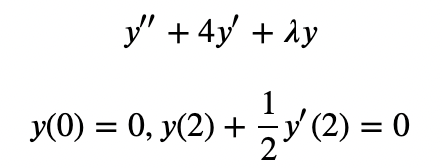
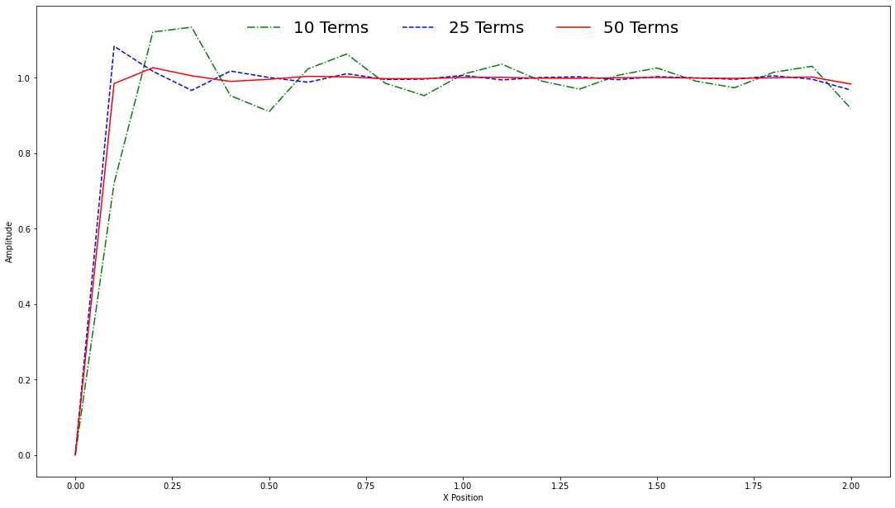

### 👋 Hello! Welcome to my the walk-through of the solution and expansion of an Eigenvalue Problem! 

---

In this walk-through, we describe the solution of the following differential equation:

  

After finding the solution, we then use the eigenfunction to verify that the convergence of the series expansion across the interval, by truncating the series to 10, 25, and 50 terms and evaluating the resulting mathematical expression, converges to f(x) = 1, as shown in the plot below.

---

 

#### For more information about me, check out my website by clicking on the logo!

  <a href="https://liamnester.github.io/" </a> 

